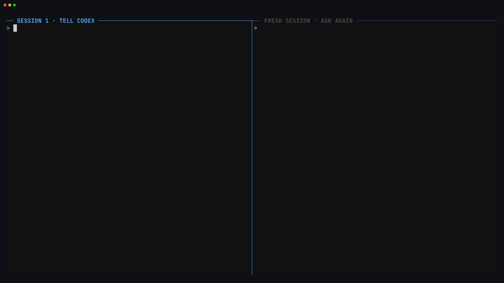
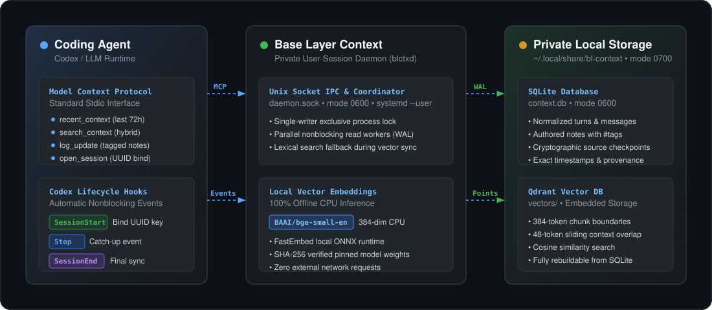

# Base Layer Context

<p align="center">
  <strong>Zero-config local agent memory that just works.</strong><br>
  <strong>Persistent, private memory for coding agents.</strong><br>
  Recall recent work and saved decisions across sessions, projects, and restarts on your machine.
</p>

<p align="center">
  <a href="https://pypi.org/project/bl-context/"></a>
  
  
  
  
</p>

---

## The Payoff: Immediate Agent Recall

We meet you where you work. **The terminal.**  And then stay out of your way. Once installed, your coding agent gains automatic, persistent context across all your projects.


Tell Codex the magic word in one session. Ask again in a fresh session and Base Layer Context brings the answer back:



---

## Why Base Layer Context?

Coding agents suffer from **agent amnesia**. When a session ends, the context window vanishes. Manually copying summaries or repasting task descriptions is tedious and burns tokens.

Base Layer Context bridges this gap with a lightweight, private, system-level memory daemon:

* 🧠 **Zero Manual Effort:** Automatically captures session starts, turn milestones, and completions via non-blocking lifecycle hooks.
* 🔒 **100% Local & Private:** Embeddings run locally on your CPU with FastEmbed (`BAAI/bge-small-en`). Vectors stay on your SSD in Qdrant. Zero telemetry, zero external API calls.
* ⚡ **Global Machine Scope:** Work from any folder or repository; your agent can recall related work across projects without rigid directory silos.
* 📜 **Source References:** Transcript excerpts retain timestamps, source locations, and session IDs. Authored notes retain their IDs and attribution. Retrieved statements are evidence, not independent verification.
* 🛡️ **Zero-Surprise Permissions:** Runs in your user session through systemd on Linux or a launchd LaunchAgent on macOS, with private mode `0700` directories and mode `0600` sockets. No root or sudo required.

---

## Quickstart (30 Seconds)

### 1. Install package

```bash
pip install bl-context
```

On macOS, install into an isolated tool environment with [uv](https://docs.astral.sh/uv/guides/tools/):

```bash
uv tool install bl-context
```

Use Python 3.10 or newer and install the Codex CLI before onboarding. Run onboarding from a logged-in macOS desktop session. The LaunchAgent starts at login and uses the installed Python environment; keep that environment available.


### 2. Onboard your agent

```bash
blc install codex
```

The interactive onboarding wizard will:
1. Initialize private user directories (`0700`; filesystem permissions, not encryption).
2. Start the lightweight background daemon (`blctxd`) as a systemd user service on Linux or a LaunchAgent on macOS.
3. Register the Model Context Protocol (MCP) server with Codex.
4. Install the `base-layer-context` recall skill.
5. Verify local CPU embeddings (`BAAI/bge-small-en`, 384 dimensions).
6. Index recent sessions and verify end-to-end memory retrieval health.

### 3. Approve hooks on next launch

When prompted during installation, choose **Enable automatic capture** (the recommended default). On your next Codex launch, open `/hooks` to review and trust the 3 local Context handlers.

---

## What to Ask Your Agent

Once onboarded, interact with your agent normally. When you need past context, simply ask:

* *"Summarize what we worked on over the last 3 days."*
* *"Where did we leave off on the database migration?"*
* *"What decisions were made regarding sensor calibration yesterday?"*
* *"Review recent test failures and uncommitted experiments."*

### Explicit Tagged Notes

Agents can also persist durable, tagged authored notes at key project milestones:

> *"Save a progress update: sensor bridge calibrated with 0.02ms latency. Tag it #sensors #calibration."*

Notes are committed to SQLite instantly and become immediately retrievable.

Try these across fresh Codex sessions:

1. Say: **“Remember that the magic word is SomeMagicWord.”** Open another session and ask **“What is the most recent magic word?”**
2. Save a different value in another session, then ask again. The newer relevant statement should be returned first.
3. After doing some work, say **“Tag the current work with test-handoff.”** In another session, say **“Refresh context from tag test-handoff.”** Your agent saves and retrieves a compact handoff with the goal, decisions, progress, and next step.

Tags are exact, case-sensitive global handles. Projects and contributing agents are provenance, not memory silos. Codex is the supported integration in V1; Claude/Gemini integrations and cross-machine synchronization are not included.

### What is retained

Automatic conversation memory lasts **7 days**. Explicit memories, authored notes, and tagged handoff summaries are durable. Context prunes expired conversation content from its SQLite and vector indexes at startup and during background maintenance. Original Codex transcript files are unchanged. Retention settings are deferred to a later release.

Installation backfills the five newest available sessions, retaining only conversation content within the seven-day window. Trusted hooks capture subsequent work. Recall reports partial or syncing coverage, including omitted initial history; it never promises a complete transcript archive.

Normal recall returns compact evidence with a 24,000-byte JSON budget, including metadata and coverage. Project overviews represent multiple projects, factual search ranks relevant evidence, and tag lookup retrieves the newest matching handoff. Your agent can expand a relevant excerpt when necessary.

---

## How It Works: Local Privacy Architecture

Base Layer Context operates as an offline, single-writer daemon communicating over a private Unix socket and the standard Model Context Protocol (MCP):



### The 4 Local Components

1. **The CLI (`blc`)**: High-level onboarding, health diagnostics, manual search, and transcript exploration.
2. **The User Daemon (`blctxd`)**: Single-writer daemon managing SQLite WAL and Qdrant local vector storage. Independent worker threads ensure queries never block during index synchronization.
3. **The Stdio MCP Server**: Exposes 8 tools: `work_overview`, `search_context`, `get_tag`, `recent_context`, `get_context`, `context_status`, `open_session`, and `log_update`.
4. **Lifecycle Hooks**: Three lightweight handlers (`SessionStart`, `Stop`, `SessionEnd`) enqueue transcript references without running embeddings. They allow up to one second for brief ownership-lock contention within a two-second hook deadline; prolonged contention is reported as a skipped capture.

---

## Everyday CLI Commands

### Health & Diagnostics

```bash
# Check current readiness and installation health
blc status

# Diagnose system health, verify daemon, and inspect checks
blc doctor
```

### Transcript Exploration (`blc explore`)

Safely inspect local Codex transcript files before importing them:

```bash
# List the newest 20 transcripts on your machine
blc explore

# Preview conversation turns and classified records
blc explore /path/to/session.jsonl --limit 3

# View raw JSONL records, token boundaries, and byte positions
blc explore /path/to/session.jsonl --view raw --limit 5
```

### Terminal Memory Queries

Query your agent's memory directly from your terminal:

```bash
# View recent turns across the last 3 days
blc recent --days 3

# Recent work grouped by project
blc overview --days 3

# Continue a saved handoff
blc tag test-handoff

# Semantic search across historical sessions
blc search "why did we switch to batched inference?"

# Check indexing status and background jobs
blc index-status
```

### Uninstallation & Clean Removal

```bash
# Deactivate integration, stop daemon, and remove hooks (retains database)
blc uninstall codex

# Complete purge (removes all database records and vectors; preserves transcripts)
blc uninstall codex --purge
```

---

## Security, Permissions & Storage Layout

Context enforces strict file permission boundaries:

| Purpose | Path | Mode | Access |
| :--- | :--- | :---: | :--- |
| **Data** | `~/.local/share/bl-context/` | `0700` | SQLite database (`context.db`, `0600`) and Qdrant vectors |
| **Config** | `~/.config/bl-context/` | `0700` | Systemd user service unit (`blctxd-*.service`) |
| **Cache** | `~/.cache/bl-context/` | `0700` | Pinned FastEmbed model weights (SHA-256 verified) |
| **State** | `~/.local/state/bl-context/` | `0700` | Installation manifest & Unix socket (`daemon.sock`, `0600`) |

On macOS the defaults are:

| Purpose | Path |
| :--- | :--- |
| **Data** | `~/Library/Application Support/bl-context/data/` |
| **Config** | `~/Library/Application Support/bl-context/config/` |
| **Cache** | `~/Library/Caches/bl-context/` |
| **State & logs** | `~/Library/Application Support/bl-context/state/` (`installation.json`, `daemon.sock`, `daemon.log`) |
| **LaunchAgent** | `~/Library/LaunchAgents/com.baselayer.context.<installation-id>.plist` |

The same private directory and file permissions apply on both platforms. The LaunchAgent uses an absolute executable and explicitly pinned storage paths, so it works without your interactive shell's PATH. macOS may list the Python executable in **System Settings → General → Login Items & Extensions**; allow it to run in the background if prompted. Codex hook trust is a separate approval in `/hooks`.

* Overrides: Both platforms respect absolute `XDG_DATA_HOME`, `XDG_CONFIG_HOME`, `XDG_CACHE_HOME`, and `XDG_STATE_HOME`, appending `bl-context/`. Relative XDG values use the platform defaults. `BLCTX_DATA_DIR`, `BLCTX_CONFIG_DIR`, `BLCTX_CACHE_DIR`, and `BLCTX_STATE_DIR` override exact directories; the installer uses these to pin native paths for child processes. All four locations must remain separate. On macOS, the LaunchAgent always lives in `~/Library/LaunchAgents` so it loads at login.
* Long paths: macOS Unix socket paths are limited to 103 bytes. If your home/state path exceeds this, select a shorter private state location with `XDG_STATE_HOME` before installing and retain that override for CLI use.
* Isolation: No sudo, no system-level daemon, no open network ports.

---

## Documentation & Contributing

* **[Developer & Contributor Guide](docs/DEVELOPMENT.md):** Test harnesses, systemd and launchd integration testing, focused step flags (`--step`), and MCP tool specifications.

---

## License

[MIT License](LICENSE) © 2026 John Furr
