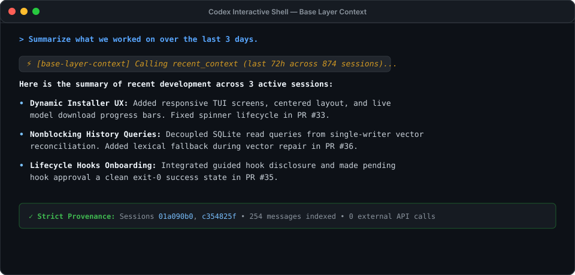

# Base Layer Context

<p align="center">
  <strong>Persistent, private memory for coding agents.</strong><br>
  Never re-explain your codebase to your agent. Automatic, durable recall across sessions, machines, and restarts.
</p>

<p align="center">
  <a href="https://pypi.org/project/bl-context/"></a>
  
  
  
  
</p>

---

## The Payoff: Immediate Agent Recall

We meet you where you work—the console—and then stay out of your way. Once installed, your coding agent gains automatic, persistent context across all your projects.


When you return to your codebase after days or weeks away, your agent recalls recent work, decisions, and milestones with full cryptographic provenance:



---

## Why Base Layer Context?

Coding agents suffer from **agent amnesia**. When a session ends, the context window vanishes. Manually copying summaries or repasting task descriptions is tedious and burns tokens.

Base Layer Context bridges this gap with a lightweight, private, system-level memory daemon:

* 🧠 **Zero Manual Effort:** Automatically captures session starts, turn milestones, and completions via non-blocking lifecycle hooks.
* 🔒 **100% Local & Private:** Embeddings run locally on your CPU with FastEmbed (`BAAI/bge-small-en`). Vectors stay on your SSD in Qdrant. Zero telemetry, zero external API calls.
* ⚡ **Global Machine Scope:** Work from any folder or repository; your agent can recall related work across projects without rigid directory silos.
* 📜 **Strict Provenance:** No hallucinated memories. Every retrieved passage links back to exact transcript timestamps, line offsets, and session IDs.
* 🛡️ **Zero-Surprise Permissions:** Runs entirely inside your Linux systemd user session with private mode `0700` directories and mode `0600` sockets. No root or sudo required.

---

## Quickstart (30 Seconds)

### 1. Install package

```bash
pip install bl-context
```

### 2. Onboard your agent

```bash
blctx install codex
```

The interactive onboarding wizard will:
1. Initialize private, encrypted user directories (`0700`).
2. Start the lightweight background daemon (`blctxd`) as a systemd user service.
3. Register the Model Context Protocol (MCP) server with Codex.
4. Install the `base-layer-context` recall skill.
5. Verify local CPU embeddings (`BAAI/bge-small-en`, 384 dimensions).
6. Index recent sessions and verify end-to-end memory retrieval health.

### 3. Approve hooks on next launch

When prompted during installation, choose **Enable automatic capture** (the recommended default). On your next Codex launch, open `/hooks` to review and trust the 3 local Context handlers.

---

## What to Ask Your Agent

Once onboarded, interact with your agent normally. When you need past context, simply ask:

* *"Summarize what we worked on over the last 3 days."*
* *"Where did we leave off on the database migration?"*
* *"What decisions were made regarding sensor calibration yesterday?"*
* *"Review recent test failures and uncommitted experiments."*

### Explicit Tagged Notes

Agents can also persist durable, tagged authored notes at key project milestones:

> *"Save a progress update: sensor bridge calibrated with 0.02ms latency. Tag it #sensors #calibration."*

Notes are committed to SQLite instantly and become immediately retrievable.

---

## How It Works: Local Privacy Architecture

Base Layer Context operates as an offline, single-writer daemon communicating over a private Unix socket and the standard Model Context Protocol (MCP):


### The 4 Local Components

1. **The CLI (`blctx`)**: High-level onboarding, health diagnostics, manual search, and transcript exploration.
2. **The User Daemon (`blctxd`)**: Single-writer daemon managing SQLite WAL and Qdrant local vector storage. Independent worker threads ensure queries never block during index synchronization.
3. **The Stdio MCP Server**: Exposes 6 standard tools (`recent_context`, `search_context`, `get_context`, `context_status`, `open_session`, `log_update`) directly to Codex.
4. **Lifecycle Hooks**: Three lightweight handlers (`SessionStart`, `Stop`, `SessionEnd`) that enqueue transcript snapshots into SQLite in under 2ms without holding your conversation open.

---

## Everyday CLI Commands

### Health & Diagnostics

```bash
# Check current readiness and installation health
blctx status

# Diagnose system health, verify daemon, and inspect checks
blctx doctor
```

### Transcript Exploration (`blctx explore`)

Safely inspect local Codex transcript files before importing them:

```bash
# List the newest 20 transcripts on your machine
blctx explore

# Preview conversation turns and classified records
blctx explore /path/to/session.jsonl --limit 3

# View raw JSONL records, token boundaries, and byte positions
blctx explore /path/to/session.jsonl --view raw --limit 5
```

### Terminal Memory Queries

Query your agent's memory directly from your terminal:

```bash
# View recent turns across the last 3 days
blctx recent --days 3

# Semantic search across historical sessions
blctx search "why did we switch to batched inference?"

# Check indexing status and background jobs
blctx index-status
```

### Uninstallation & Clean Removal

```bash
# Deactivate integration, stop daemon, and remove hooks (retains database)
blctx uninstall codex

# Complete purge (removes all database records and vectors; preserves transcripts)
blctx uninstall codex --purge
```

---

## Security, Permissions & Storage Layout

Context enforces strict file permission boundaries:

| Purpose | Path | Mode | Access |
| :--- | :--- | :---: | :--- |
| **Data** | `~/.local/share/bl-context/` | `0700` | SQLite database (`context.db`, `0600`) and Qdrant vectors |
| **Config** | `~/.config/bl-context/` | `0700` | Systemd user service unit (`blctxd-*.service`) |
| **Cache** | `~/.cache/bl-context/` | `0700` | Pinned FastEmbed model weights (SHA-256 verified) |
| **State** | `~/.local/state/bl-context/` | `0700` | Installation manifest & Unix socket (`daemon.sock`, `0600`) |

* Overrides: Respects absolute `XDG_DATA_HOME`, `XDG_CONFIG_HOME`, `XDG_CACHE_HOME`, and `XDG_STATE_HOME`.
* Isolation: No sudo, no system-level daemon, no open network ports.

---

## Documentation & Contributing

* **[Developer & Contributor Guide](docs/DEVELOPMENT.md):** Test harnesses, systemd integration testing, focused step flags (`--step`), and MCP tool specifications.

---

## License

[MIT License](LICENSE) © 2026 John Furr
