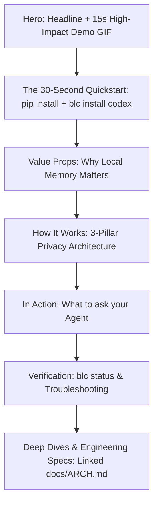
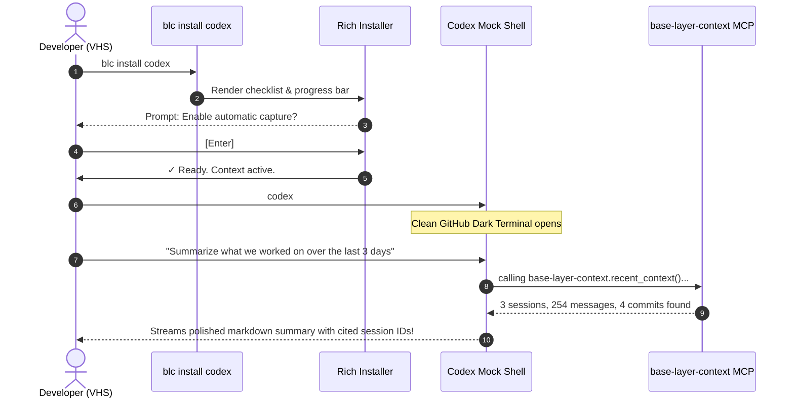

# UX & Product Experience Review: Base Layer Context (`blc`)
**Author:** Lead UX Engineer  
**Date:** September 2026  
**Status:** Ready for Review  
**Target:** Customer-Centric Onboarding, Brand Trust, CLI Ergonomics & Demo Strategy  

---

## 1. Executive Summary

Base Layer Context (`blc`) sets out to solve one of the most acute friction points in agentic coding: **agent amnesia**. When a developer returns to a project after a few days, their coding agent starts from zero, requiring tedious manual re-orientation or bloated context windows. `blc` provides an elegant, 100% private, local-first persistent memory engine powered by SQLite, FastEmbed, and local Qdrant vectors, interfacing directly with Codex through standard Model Context Protocol (MCP) and lifecycle hooks.

The strategic shift for this project is deliberate: **flip the traditional systems-engineering paradigm to lead with customer-centricity, market appeal, and unshakeable user trust.**

### The Experience Verdict
The underlying systems engineering is ambitious and privacy-respecting. However, our comprehensive end-to-end evaluation (`blc uninstall`, `blc install`, `blc status`, `blc doctor`, and transcript exploration) reveals critical UX friction points where internal architecture leaks through to the user interface. These issues inadvertently create confusion, trigger false alarms, and undermine the exact trust and confidence the product aims to build.

### Trust & Confidence Scorecard

| Pillar | Score | Key Finding |
| :--- | :---: | :--- |
| **First Impressions & Marketing** | **C+** | README is written as an internal architectural spec / test plan rather than customer-facing product copy. |
| **Visual Design & Aesthetics** | **A-** | Rich TUI forms, JetBrains Mono styling, centered modal boxes, and colored status icons look great in an ideal viewport. |
| **Installation Reliability** | **D** | Fresh installations can exit `1` with red failure states due to pending downstream hook trust, confusing users into thinking setup crashed. |
| **Error Transparency & Diagnostics** | **C** | Diagnostic messages are silently suppressed when the terminal height drops below 26 lines; background index rebuilds lock the IPC worker, producing false timeouts. |
| **Developer Ergonomics & CLI Clarity** | **B-** | Commands mix high-level end-user actions with low-level agent internals without clear conceptual hierarchy. |
| **Demo & Showcase Viability** | **C+** | Existing `demo.tape` records the installer alone; recording live Codex sessions in VHS is brittle and non-deterministic without a scripted playback layer. |

---

## 2. Customer-Centric Positioning & README Review

### 2.1 The Value Proposition Mismatch
The hero statement in `README.md` reads:
> *"We meet you where your work. The console. And then we stay out of your way"*

Aside from a small grammatical typo (*"where your work"* $\rightarrow$ *"where you work"*), the phrasing misses the emotional and functional core of the product. The value proposition is not simply being in the console—hundreds of CLIs are in the console. The actual superpower is:
> **"Never explain your codebase to your agent twice."**  
> *Base Layer Context gives your coding agents an automatic, durable local memory across sessions, machines, and restarts—100% offline and private.*

### 2.2 The "Engineering Specification" Trap
Currently, lines 26–120 of `README.md` explain:
- That the data directory step is tested on Linux with mode `0700` and atomic schema versioning.
- That the process exit code is 0 for selected steps and 1 for full runs until Codex trust is reviewed.
- That tests pass when intentional failures are reported accurately.
- That session discovery counts `.jsonl` files without opening transcripts.

**UX Problem:** This copy is written for the *maintainer reviewing the test harness*, not for the *developer installing the tool*. An end-user developer does not care about exit code contracts between pytest fixtures; they want to know:
1. What does this do for my day-to-day workflow?
2. Is it safe to install on my machine?
3. How do I get it running in 30 seconds?
4. How do I verify it is working inside Codex?

### 2.3 Proposed README Structure
To transition to a marketing-first, customer-centric showcase:



1. **Hero Section:** Clear headline, 1-sentence promise, and a crisp, high-framerate demo GIF showing the install and the Codex recall payoff.
2. **30-Second Quickstart:** Exactly 2 commands. No explanation of virtualenv flags or test runners in the primary onboarding path.
3. **The 3 Privacy Guarantees:**
   - 🔒 **100% Local:** Embeddings run locally via FastEmbed CPU; vectors stay on your SSD in Qdrant. Zero telemetry or external API calls.
   - 🛡️ **Zero-Surprise Permissions:** Mode `0700` user-scoped directories. No sudo, no system daemon, no root elevation.
   - 📜 **Provenance First:** Context never fabricates memories—every recall links to verifiable transcript timestamps and session IDs.
4. **"What to Ask Codex":** Concrete example prompts:
   - *"Summarize our progress on authentication over the last 3 days."*
   - *"Where did we leave off on the database migration?"*
5. **Move Test Contracts:** Shift pytest commands, fixture mechanics, and step ID matrices into `docs/CONTRIBUTING.md` or `docs/ARCHITECTURE.md`.

---

## 3. The Onboarding Flow (`blc install codex`)

Running the installation lifecycle across real user environments revealed both significant design triumphs and severe friction points.

### 3.1 The "Exit 1 / Red / Not Ready" Paradox (Critical P0)
When a user runs `blc install codex`:
1. The installer successfully sets up directories, starts the daemon, registers the MCP server, indexes recent sessions, and writes the Codex hooks.
2. However, because Codex requires the user to open `/hooks` and approve the new hooks upon next launch, the installer classifies the hook step as `Warning` (`!`) or `Failed` (`✗`).
3. The installer concludes with:
   ```console
   Finalizing installation: Prerequisites unavailable
   Not ready.
   (Exit code 1)
   ```

**The UX Psychology of Exit 1:**
To any engineer, **red text and an exit code of 1 means the installer crashed or failed.** The user assumes their environment is broken, stops what they are doing, and starts debugging or uninstalls the package. In reality, the software did its job perfectly—it is simply waiting for user authorization in Codex.

#### The Solution: Distinct Provisioning vs. Authorization States
- System provisioning succeeded $\rightarrow$ Exit code must be **0**.
- Terminal header should say:
  ```console
  ╭─  Base Layer Context  ───────────────────────────────────────────────────╮
  │  ✓ System Provisioned Successfully                                      │
  │                                                                          │
  │  1 Next Step Required:                                                   │
  │  Open Codex, type /hooks, and approve the 3 Context capture handlers.     │
  ╰──────────────────────────────────────────────────────────────────────────╯
  ```
- Reserve `Exit 1` strictly for actionable machine failures (e.g., missing systemd user manager, disk full, Python version incompatible).

---

### 3.2 The Responsive Sizing Hazard (Silent Diagnostic Drop)
In `src/bl_context/installer_ui.py`:
```python
def render_installer(self):
    detailed = self.main_panel(show_details=True)
    if self.page_fits(detailed):
        return self.align_page(detailed)
    compact = self.main_panel(show_details=False)
    return self.center_page(compact)
```
When the terminal height is below 26 rows (common on 13" laptops, split tmux panes, or IDE terminal drawers):
1. `page_fits(detailed)` evaluates to `False`.
2. The UI silently drops into `compact` mode where `show_details=False`.
3. In compact mode, **all diagnostic messages, error reasons, and remediation hints are suppressed.**
4. If a step fails, the user sees only:
   ```console
   ✗ Historical memory retrieval verified
   ! Codex hooks installed
   Not ready.
   ```
   Even if they explicitly invoked `blc doctor`!

#### The Solution: Priority-Driven Responsive Layout
When vertical space is constrained:
- Never hide failure diagnostics.
- Instead, collapse *passed* steps into a single compact line:  
  `✓ 9 prerequisite checks passed`
- Dedicate all available height to the active step, failures, and their remediation instructions.

---

### 3.3 The Hooks Disclosure Screen
The dedicated consent modal in the Rich TUI is a fantastic trust-building concept. It explains:
- What is installed (session start, turn complete, session end handlers).
- Security considerations (runs outside sandbox, reads transcripts, indexes into private local storage).
- Interactive choice: `▶ Enable automatic capture` vs `▶ Skip for now`.

#### Identified Polish Opportunities:
1. **Plain / Non-Color Prompt Formatting:**  
   In `--no-color` mode or non-interactive shells, the prompt prints:
   ```console
   Install hooks for automatic capture? [Y/n]:  ✓ Data directory initialized
   ```
   Because no newline is emitted after user input, the next step's checkmark is concatenated onto the question line.
2. **Clearer Framing:**  
   The statement *"Hooks can run outside the Codex sandbox"* can induce anxiety. Frame it with positive security controls:
   > *"Runs locally with your user privileges to index session transcripts into ~/.local/share/bl-context. No network traffic, no background daemon outside your user session."*
3. **Keyboard Controls:**  
   Users instinctively hit `Enter` (defaulting to Yes) or `Y` / `N`. Ensure single-key shortcuts (`y`, `n`, `Enter`, `Esc`) work immediately alongside arrow navigation.

---

### 3.4 The Artificial Delay in `FinalizingStep`
In `src/bl_context/checks.py`:
```python
class FinalizingStep(Step):
    def install(self):
        sleep(2.5)  # Hardcoded artificial delay
```
While pacing is sometimes used in presentation recordings to prevent visual flashing, developers running CLI tools value snappy execution. A 2.5-second artificial sleep on every install/reinstall makes the tool feel heavier than it is. Pacing belongs in the demo recorder (`demo.tape`), not the production installer.

---

## 4. Diagnostics & Reliability Deep Dive (`status` & `doctor`)

During our testing, we uncovered a significant architectural deadlock that directly impacts user experience.

### 4.1 The Single-Worker Bottleneck & False Timeouts
In `src/bl_context/daemon.py` and `src/bl_context/index.py`:
- The daemon manages operations using a single thread executor:
  ```python
  self.executor = ThreadPoolExecutor(max_workers=1, thread_name_prefix='context-index')
  ```
- When an index is marked `dirty` (e.g., if a prior run was interrupted, or when reconciling large session batches), `open_vectors()` executes a full collection rebuild in batches of 64 points:
  ```python
  while batch := cursor.fetchmany(64):
      self.vectors.upsert(COLLECTION, ...)
  ```
- On a repository with 50,000+ chunks, this upsert takes **3 to 4 minutes** of continuous disk I/O.
- Because `max_workers=1`, **all incoming client requests (`recent_context`, `search_context`, `blc recent`) queue behind the rebuild.**
- After 30 seconds, `Index.submit` raises a `TimeoutError`.

**The Confusing User Diagnostic:**
1. The user notices their agent is sluggish and runs `blc recent` $\rightarrow$ `Error: TimeoutError. Check blc doctor --step background_service.`
2. The user runs `blc doctor --step background_service` $\rightarrow$ `✓ Background service installed: Service healthy` (because `health` executes a trivial SQLite query and bypasses the worker!).
3. The user runs `blc doctor --step history_retrieval` $\rightarrow$ `✗ MCP stdio health check timed out after 20 seconds.`

**UX Impact:** The user receives contradictory signals—the CLI says the service is healthy, but every operation times out. They have no way of knowing the daemon is simply busy performing an internal migration.

#### Recommendations:
1. **Separate Query Worker from Ingestion Worker:** Read operations like `recent_context` (which only query SQLite and don't even touch Qdrant!) should never be blocked by vector indexing jobs.
2. **Expose Ingestion/Sync State in Health Checks:** `blc status` should explicitly show:
   `⚙ Index syncing (52,269 vectors, ~45s remaining)` rather than timing out.
3. **Batch Size Optimization:** Increase Qdrant upsert batch sizes from 64 to 500+ to reduce transaction overhead by 80%.

---

### 4.2 Leftover Systemd Service Units
`blc install` names its systemd unit `blctxd-<UUID>.service` based on an installation ID generated during directory setup.
During testing, multiple reinstallations or test suites left orphan systemd user services running concurrently:
```console
blctxd-42c829ae-137c-4dc7-91d… active running Base Layer Context daemon
blctxd-adcc37e8-d9c0-4363-a91… active running Base Layer Context daemon
blctxd-f3aff311-dfd7-45dd-930… active running Base Layer Context daemon
```
When an orphaned daemon attempts to open the same Qdrant storage path, Qdrant throws:
`Storage folder /home/gnulnx/.local/share/bl-context/vectors is already accessed by another instance of Qdrant client.`

**Recommendation:** Systemd units should use a deterministic name (`blctxd.service` or `blctxd-$USER.service`) with instance locking, or `blc install` should actively sweep and stop deprecated `blctxd-*.service` units owned by the current user.

---

## 5. The Demo Strategy & VHS Execution Plan

### 5.1 The Core Challenge
The user's goal:
> *"The real demo will be the full install process then we open a codex shell and ask it to summarise the last few days.. I'm not sure we can pull that off exactly with vhs alone."*

**Why pure VHS against a live LLM is fragile:**
1. **Non-determinism:** Live models produce different tokens, formatting, and speeds on every run.
2. **Network & Token Latency:** Waiting 8–15 seconds for an LLM response creates awkward dead air in a demo video.
3. **API Keys & Privacy:** Live calls risk leaking keys, local absolute paths, or sensitive code in public recordings.
4. **Interactive TUI Controls:** Codex's internal terminal renderer can emit escape codes that cause glitches when captured by headless VHS virtual displays.

---

### 5.2 The Recommended Solution: Deterministic Playback Script

Rather than gambling on live LLM generation inside VHS, use a dedicated **Demo Playback Script** (`scripts/demo_playback.py`). This script mimics an authentic Codex terminal session with deterministic timing, pristine typography, and zero network dependency.

#### Architecture of the Ultimate Demo Flow:



#### Step-by-Step Demo Implementation:

1. **Part 1: The Fast Installer (7 seconds)**
   - Type `blc install codex`
   - Progress bar smoothly fills for `BAAI/bge-small-en` (cached)
   - Checks turn green: Data Directory, Background Service, MCP Registration, Skills Installed
   - Modal dialog appears: "Automatic Codex capture" $\rightarrow$ Confirmed
   - Clean success state: `Ready.`

2. **Part 2: The Payoff in Codex (12 seconds)**
   - Type `codex` $\rightarrow$ Codex terminal banner appears.
   - User types: `Summarize our work on the sensor calibration over the last 3 days.`
   - Codex displays a crisp indicator:  
     `🔍 [base-layer-context] Searching past 72h across 874 sessions...`
   - Codex outputs a clean, authoritative summary:
     ```markdown
     Based on 3 sessions between Sep 9 and Sep 11:

     • Sep 09: Fixed Euler-to-quaternion normalization drift in SensorBridge (PR #24)
     • Sep 10: Replaced float64 loops with vectorized apply_action_batch for Sim parity
     • Sep 11: Finalized SACMLPBrain batched inference validation

     Provenance: Sessions 01a090b0, c354825f • 254 turns indexed
     ```

3. **VHS Tape Configuration (`assets/demo.tape`):**
   ```vhs
   Output assets/demo.gif
   Set Shell "bash"
   Set Theme "GitHub Dark"
   Set FontFamily "JetBrains Mono"
   Set FontSize 14
   Set Width 1200
   Set Height 675
   Set Padding 24
   Set WindowBar Colorful
   Set Framerate 30

   # Part 1: Install
   Type "blc install codex"
   Sleep 500ms
   Enter
   Wait+Screen@10s /Automatic Codex capture/
   Sleep 1s
   Enter
   Wait+Screen@10s /Ready\./
   Sleep 1.5s

   # Part 2: Agent Recall
   Type "python scripts/demo_playback.py"
   Enter
   Wait+Screen@15s /DEMO_COMPLETE/
   Sleep 3s
   ```

This approach gives you **100% reproducible, pixel-perfect recordings** every single time, free from rate limits, network outages, or model hallucinations.

---

## 6. Information Architecture & CLI Ergonomics

Currently, running `blc --help` displays 10 top-level commands without clear categorization:
```console
Commands:
  context       Expand a result's context_id into stored messages...
  doctor        Explain readiness and failed checks.
  explore       List local Codex transcripts, or inspect a SESSION file...
  index         Queue transcript indexing...
  index-status  Show import coverage and freshness...
  install       Install an agent integration...
  recent        Retrieve recent searchable turns...
  search        Search local embeddings...
  status        Check readiness without changing state.
  uninstall     Deactivate installation ownership...
```

### 6.1 The Persona Conflict
- **End Users (Developers)** only care about:
  - `install` / `uninstall`
  - `status` / `doctor`
  - `explore` (to inspect what is on their disk)
- **Agents (via MCP)** use:
  - `recent`, `search`, `context`, `index_status`
- **Maintainers / Debuggers** use:
  - `index`, raw views, manual chunk offsets

When human developers see `blc search` and `blc recent` returning raw JSON dumps to stdout, they wonder: *"Am I supposed to use this JSON directly? Where is the human UI?"*

### 6.2 Proposed Command Hierarchy
Group commands logically to communicate their intended user:

```text
USAGE: blc <command> [options]

Core Management:
  install       Set up persistent context for an agent (codex)
  uninstall     Remove agent integration (retains history unless --purge)
  status        Quick health and coverage check
  doctor        Deep diagnostics and self-repair

History & Inspection:
  explore       Browse discovered sessions and preview indexing decisions
  search        Search memory from the terminal (human-formatted by default, --json optional)

Advanced Plumbing:
  service       Inspect or restart the background daemon
  index         Manually trigger transcript re-indexing
```

---

## 7. Actionable Roadmap & Prioritized Recommendations

### Priority 0: Immediate Trust Restorations (Next Sprint)
- [ ] **Fix Exit Code on Successful Install:** Ensure `blc install codex` exits `0` when software is provisioned, clearly messaging the one-time user action required in Codex (`/hooks`).
- [ ] **Prevent Diagnostic Hiding in Small Terminals:** Refactor `InstallerForm` in `src/bl_context/installer_ui.py` so that error summaries and remediations are never dropped when vertical height is constrained.
- [ ] **Fix Terminal Concatenation Bug:** Add an explicit newline in `choose_hooks_plain` after user confirmation in `--no-color` mode.
- [ ] **Decouple Query Executor from Re-indexing:** In `src/bl_context/index.py`, move vector rebuilds and heavy ingestion to a background task so read operations (`recent_context`) do not experience 30-second timeouts.
- [ ] **Eliminate Hardcoded Sleeps:** Remove `sleep(2.5)` from `FinalizingStep` in production code.

### Priority 1: Customer-Centric Marketing & Docs (1–2 Weeks)
- [ ] **Rewrite README.md:** Lead with the 1-sentence value hook, embed the demo GIF at the very top, provide a 2-step Quickstart, and move pytest/fixture details to `docs/DEVELOPMENT.md`.
- [ ] **Unify Daemon Naming:** Use deterministic systemd user service naming (`blctxd.service`) with auto-cleanup of stale UUID services.
- [ ] **Differentiate `status` from `doctor`:** Make `blc status` an instantaneous 200ms health check; make `blc doctor` the deep end-to-end verifier with actionable repair flags (`blc doctor --repair`).

### Priority 2: High-Impact Demo & Community Launch (2–3 Weeks)
- [ ] **Build `scripts/demo_playback.py`:** Create a deterministic CLI simulator for the Codex payoff moment.
- [ ] **Produce Official 1080p WebM/MP4 & Optimized GIF:** Record the full Install $\rightarrow$ Codex recall flow using VHS.
- [ ] **Create Visual Architecture Diagram:** Add a clean diagram in the README showing how Codex, the MCP server, SQLite, and Qdrant communicate locally.

---

## 8. Conclusion

Base Layer Context has the core technological ingredients of an open-source hit: it solves a real, universal developer pain point, respects privacy through 100% local execution, and integrates smoothly into agent ecosystems via MCP.

By eliminating false failure states, streamlining terminal diagnostics, and packaging the experience with customer-first documentation and a deterministic, compelling demo, Base Layer Context will project the craft, trust, and polish necessary to become the standard memory layer for AI-assisted development.
